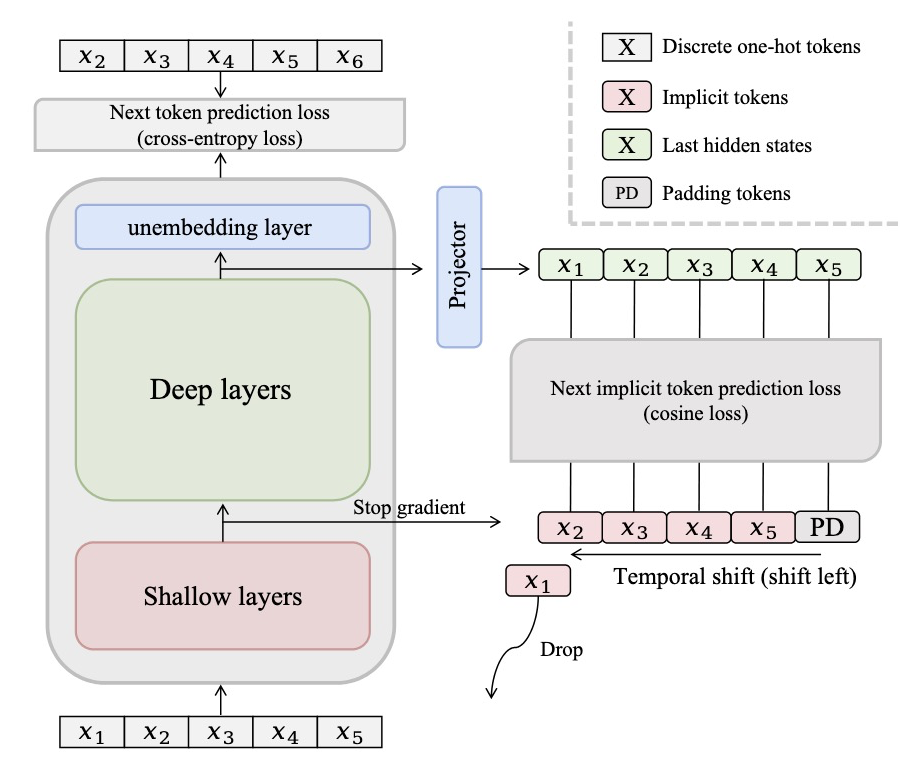

> 本文基于 ICML 2026 论文 [NITP: Next Implicit Token Prediction for LLM Pre-training](https://arxiv.org/abs/2605.24956)，Zhang et al., 2026。

尽管大语言模型的规模和复杂度都在不断增长，但在预训练阶段，它们被要求做的基本上只有一件事：Next-token prediction（NTP）。这是一个非常简单的目标：给定前面所有的 token，预测下一个。

然而，预测对了下一个 token，并不能指导模型内部如何表示它，这部分只能靠模型自己摸索。更麻烦的是，不同的隐表示可以产生相同的输出分布，只要最终预测正确，损失函数对不同的隐表示就没有任何偏好，于是可能出现表示退化的问题（representation degeneration）。模型被告知要预测什么，但对于隐空间应该长成什么样，它得到的监督要弱得多。

NITP 的解决方法十分简单。除了要让模型预测下一个 token 是什么，还要让它预测下一个 token 的隐表示。这可以被理解为每个 next token 在训练时都被预测了两次：一次在输出空间，一次在隐空间。

> 表示退化可能会对模型在下游任务上的泛化表现造成负面影响。

## 核心思想

NITP 引入了一个自监督目标，以自回归的方式，用较浅层的隐表示直接监督下一个 token 的隐表示。

**NITP 就是隐空间里的 NTP：NTP 规定了要预测什么，却没有监督预测是如何被表示的，NITP 则补上了这个空缺。**

## NITP 目标函数

令 $\mathbf{z}_{t+1}$ 表示位置 $t+1$ 上 token 的浅层表示，$\mathbf{h}_t$ 表示位置 $t$ 的最终隐状态。令 $P$ 为一个可学习的 projection，把 $\mathbf{h}_t$ 映射到浅层表示所在的空间。NITP 用余弦损失将 $P(\mathbf{h}_t)$ 与下一个隐式 token 的表示对齐：

$$
\mathcal{L}_{\mathrm{NITP}} = 1 - \frac{P(\mathbf{h}_t)^\top \mathbf{z}_{t+1}}{\left\lVert P(\mathbf{h}_t) \right\rVert_2 \left\lVert \mathbf{z}_{t+1} \right\rVert_2}.
$$

> 除余弦相似度之外，论文中还探讨了 MSE、Smooth L1 和 KL 散度作为 loss 的可行性，结果是余弦相似度效果最好。

这里的投影 $P$ 是必要的，它用来弥合浅层与深层之间的*分布差异*。

完整的预训练损失为：

$$
\mathcal{L}_{\mathrm{total}}(\theta) = \mathcal{L}_{\mathrm{NTP}}(\theta) + \lambda \mathcal{L}_{\mathrm{NITP}}(\theta),
$$

其中 $\theta$ 为模型参数，$\lambda$ 是控制 NITP 正则化强度的超参数。

## 一些想法

跨层监督不是新想法。此前的工作已经探索过在不同层之间对齐隐表示，*自蒸馏*就是典型例子：浅层常被训练去模仿深层的表示。NITP 不同的地方很关键：监督信号不只在层之间竖向移动，还在位置之间横向移动（*temporal shift*）。作者也做了消融实验，结果显示这个时间偏移正是性能提升的关键。

不同层隐表示的语义丰富程度同样已经被研究得比较清楚。原始 embedding 受*多义性*的困扰；经过若干个 transformer block 之后，token 表示逐渐被上下文消去歧义，同时仍保留细粒度词汇本身的语义信息；到了更深的层，表示变得更抽象、更贴合具体任务，语义丰富度反而下降。这正是 NITP 选择浅层作为监督目标的原因：浅到还留着语义丰富度，又深到已经根据上下文完成了歧义消除。

基于这些认识，NITP 给出了一个相当简单、却确实有效的预训练改进方式。
